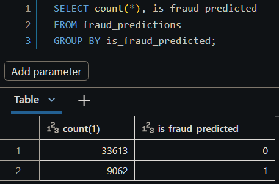

# Real-Time Fraud Detection System (Databricks & PySpark)

---

## Architecture & Execution Phases

```
┌─────────────────────────────────────────────────────────────────────────────┐
│                             DATABRICKS CLOUD                                │
│                                                                             │
│  [ PHASE 1: REAL-TIME DETECTION (24/7 Continuous Streaming) ]               │
│  S3 Raw Bucket ──► PySpark Structured Streaming ──► Feature Engineering     │
│                                                           │                 │
│  Alert Output ◄── Cutoff Threshold (>= 0.9980) ◄── MLflow Model UDF        │
│                                                                             │
│  ─────────────────────────────────────────────────────────────────────────  │
│                                                                             │
│  [ PHASE 2: WEEKLY MODEL RETRAINING (Scheduled Batch Workflow) ]             │
│  Historical Delta/S3 ──► Feature Pipeline ──► CatBoost Train ──► MLflow     │
│                                                                     │       │
│  MLflow Registry ("Production") ◄───────────────────────────────────┘       │
└─────────────────────────────────────────────────────────────────────────────┘
```

### Data Source & ML Mechanism
- **Data Source**: Credit card transaction stream containing cardholder demographics, timestamps, geo-coordinates (`lat`/`long`), merchant info, transaction amount (`amt`), and historical fraud labels.

<p align="center">
  
</p>

```
timestamp     : 2024-01-02 03:19:49                      >>>> when
cc_num + coordinates    : 06040191765 + lat/long         >>>> who + Where H 
amt           : 34.46                                    >>>> Much?
category      : grocery_pos                              >>>> What?
merchant + coordinates : Swaniawski Inc + lat/long       >>>> Where T
is_fraud      : 0                                        >>>> is it F?
```

#### Pattern of Transaction / holder
- Time (day & hour / velocity) 
- Amount (recent / historical spending)
- Distance
- Online vs POS
- Merchant fraud before? (how many transaction to unique merchant)

- **ML Engine**: **CatBoost Classifier** trained on **20 engineered features** (spatial, velocity, static, and historical risk lookup rates).

- **Inference Mechanism**: Real-time transactions are transformed on arrival, scored via PySpark MLflow UDF, and flagged as fraud when probability meets or exceeds the **0.9980** threshold.

---

## Repository Directory Structure

```
Databricks run/
├── config/
│   └── pipeline_config.yaml          # Hyperparameters and path configurations
├── notebooks/                         # Experimental & EDA Notebooks
│   ├── 01_eda.ipynb                  # Exploratory data analysis
│   ├── 02_feature_engineering.ipynb  # Feature building prototypes
│   └── 03_model_training.ipynb       # Model tuning & benchmark trials
├── src/
│   ├── features/                     # Modular PySpark feature engineering
│   │   ├── static_features.py        # Row-level & date-time transformations
│   │   ├── geospatial_features.py    # Haversine distance calculation
│   │   ├── window_features.py        # Rolling 1h/24h cardholder velocity
│   │   └── lookup_features.py        # Target encoding (risk rates by entity)
│   ├── model/                        # CatBoost training & evaluation logic
│   │   ├── train.py                  # Model fitting with early stopping
│   │   ├── evaluate.py               # Classification metrics (AUC, F1, Precision)
│   │   ├── threshold.py              # Cross-validated threshold optimizer
│   │   └── shap_explainer.py         # SHAP feature importance calculation
│   ├── retraining/
│   │   └── weekly_retrain.py         # Job 1: Scheduled weekly batch retraining
│   └── scoring/
│       └── realtime_detection.py     # Job 2: 24/7 PySpark streaming listener
├── tests/                             # Unit tests for feature transformers
└── README.md                         # Project documentation
```

> 📌 **Key Experimental Findings (`notebooks/`)**:
> Systematic trial runs evaluated SMOTENC vs. native class weighting. The **winning configuration** locked into production is:

- **CatBoost Parameters**: 
    - **`scale_pos_weight`**: **`5.0`** 
    - **`l2_leaf_reg`**: **`15`** 
    - **`depth`**: **`6`**
    - **`learning_rate`**: **`0.03`**
    - **`iterations`**: **`1500`**
    - **Operational Cutoff Threshold**: **`0.9980`**
    - **Benchmark Results**: Test Precision increased to **34.4%** (1 in 3 alerts is genuine fraud), Recall **38.2%**, AUC **0.8262**, F1 **0.3622**.

---

## ⚙️ Core Functions Reference

### 1. Feature Engineering (`src/features/`)

| Module | Function | Description |
| :--- | :--- | :--- |
| [static_features.py](file:///g:/CS/ITI/DM%209M%20%28ismalia%29/Ptoject/ITI/fraud/aws_proj/bricks/Databricks%20run/src/features/static_features.py) | `build_static_features(df)` | Casts raw column types, builds timestamp, extracts temporal features (`hour`, `day_of_week`, `month`), and calculates Euclidean distance. |
| [geospatial_features.py](file:///g:/CS/ITI/DM%209M%20%28ismalia%29/Ptoject/ITI/fraud/aws_proj/bricks/Databricks%20run/src/features/geospatial_features.py) | `build_geospatial_features(df)` | Computes Haversine great-circle distance (in km) between customer and merchant location. |
| [window_features.py](file:///g:/CS/ITI/DM%209M%20%28ismalia%29/Ptoject/ITI/fraud/aws_proj/bricks/Databricks%20run/src/features/window_features.py) | `build_window_features(df)` | Computes rolling 1h/24h transaction counts, 24h spend totals/averages, unique merchants, and time elapsed since previous transaction per credit card (`cc_num`). |
| [lookup_features.py](file:///g:/CS/ITI/DM%209M%20%28ismalia%29/Ptoject/ITI/fraud/aws_proj/bricks/Databricks%20run/src/features/lookup_features.py) | `build_lookup_features(df, train_df)` | Target encodes category, merchant, and state risk levels by computing historical fraud rates on training data and left-joining them. |

### 2. Model Logic (`src/model/`)

| Module | Function | Description |
| :--- | :--- | :--- |
| [train.py](file:///g:/CS/ITI/DM%209M%20%28ismalia%29/Ptoject/ITI/fraud/aws_proj/bricks/Databricks%20run/src/model/train.py) | `train_model(X_train, y_train, X_val, y_val, model_params)` | Prepares CatBoost Pools with categorical columns, configures validation early stopping, and fits the classifier. |
| [evaluate.py](file:///g:/CS/ITI/DM%209M%20%28ismalia%29/Ptoject/ITI/fraud/aws_proj/bricks/Databricks%20run/src/model/evaluate.py) | `evaluate_model(model, X_test, y_test, threshold)` | Computes ROC-AUC, Precision, Recall, F1-Score, and Confusion Matrix at a given cutoff. |
| [threshold.py](file:///g:/CS/ITI/DM%209M%20%28ismalia%29/Ptoject/ITI/fraud/aws_proj/bricks/Databricks%20run/src/model/threshold.py) | `find_best_threshold(model, X_val, y_val)` | Sweeps probability space using `TimeSeriesSplit` cross-validation to maximize F1-score. |
| [shap_explainer.py](file:///g:/CS/ITI/DM%209M%20%28ismalia%29/Ptoject/ITI/fraud/aws_proj/bricks/Databricks%20run/src/model/shap_explainer.py) | `compute_shap_reasons(model, X)` | Computes SHAP values via `TreeExplainer` for model interpretability. |

---

## Execution & Production Deployment

The pipeline runs via two decoupled Databricks Jobs:

### Job 1: Scheduled Weekly Retraining
- **File**: `src/retraining/weekly_retrain.py`
- **Schedule**: Weekly Cron (e.g. Every Sunday at 02:00 AM)
- **What it does**: 
  1. Loads historical data and executes `build_static_features`, `build_window_features`, `build_geospatial_features`, and `build_lookup_features`.
  2. Performs time-based Train/Val/Test split (70/15/15).
  3. Fits `train_model()` using hyper-parameters (`scale_pos_weight=5.0`, `l2_leaf_reg=15`).
  4. Evaluates performance against test set and logs metrics/confusion matrix to MLflow.
  5. Registers and promotes the model in **MLflow Model Registry** under `fraud_detection_catboost`.

### Job 2: 24/7 Real-Time Detection
- **File**: `src/scoring/realtime_detection.py`
- **Schedule**: Continuous PySpark Streaming (24/7)
- **What it does**:
  1. Listens continuously to incoming raw transaction parquet files landing on S3 via `spark.readStream`.
  2. Applies feature engineering pipeline on incoming stream.
  3. Loads active production model from MLflow Registry via `mlflow.pyfunc.spark_udf`.
  4. Scores transactions in parallel and applies `0.9980` cutoff threshold (`is_fraud_predicted: 1/0`).
  5. Writes output predictions continuously to destination S3 bucket using streaming checkpoints.

#### Test fraud detection result

<p align="center">
  
</p>

---

## Databricks Deployment Steps

1. Upload the `src/` directory to your Databricks Workspace or connect via Git integration.
2. **Create Retraining Job**:
   - Type: `Python Script` $\rightarrow$ Path: `src/retraining/weekly_retrain.py`
   - Trigger: `Schedule` (Weekly).
3. **Create Detection Job**:
   - Type: `Python Script` $\rightarrow$ Path: `src/scoring/realtime_detection.py`
   - Trigger: `Continuous` (Retry Policy: Unlimited).
