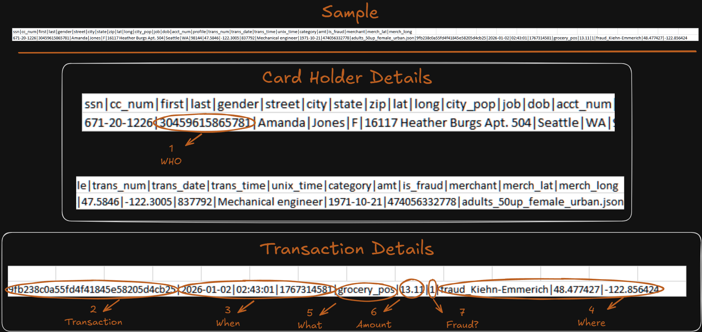

<p align="center">
  
</p>

# Fraud-detection-pipeline

**TransactSafe** is an event-driven data streaming pipeline designed for **real-time credit card fraud detection and dimensional data warehousing**.

The project combines real-time data ingestion, AWS cloud infrastructure, Apache Kafka, Spark Structured Streaming, Databricks, Machine Learning, MLflow, Snowflake, and Power BI to build an end-to-end fraud detection solution.

---

# 1- Data Streaming & Ingestion

The **Data Streaming & Ingestion** component is the first stage of the **TransactSafe** fraud detection pipeline.

This part was implemented on **Amazon Web Services (AWS)** and is responsible for preparing both **historical transaction data** and **real-time streaming data**, running the ingestion infrastructure, and delivering transaction data to **Amazon S3** for downstream fraud detection and Machine Learning.

The ingestion layer combines **Python, Apache Kafka, Spark, Spark Structured Streaming, Docker, AWS EC2, and Amazon S3**.

---

## 1.1 Transaction Data

The pipeline works with credit card transaction data containing customer, card, transaction, merchant, financial, and geographical attributes.

A transaction record contains fields such as:

```text
• ssn                  → Customer identifier
• cc_num               → Credit card number
• first / last         → Customer information
• gender               → Customer attribute
• street / city / state / zip → Customer address
• lat / long           → Customer geographical coordinates
• job / dob            → Customer information
• acct_num             → Account number
• trans_num            → Unique transaction identifier
• trans_date           → Transaction date
• trans_time           → Transaction time
• unix_time            → Unix timestamp
• category             → Transaction category
• amt                  → Transaction amount
• merchant             → Merchant name
• merch_lat            → Merchant latitude
• merch_long           → Merchant longitude
```


---

## 1.2 Data Preparation — Historical & Streaming Modes

The ingestion layer supports two different execution modes:

* **Historical Mode** – used to generate and prepare the initial historical dataset.
* **Streaming Mode** – used to generate new transaction batches that simulate real-time transaction events.

The main preparation logic is handled by `prepare_data.py`.

The workflow first checks whether the historical dataset already exists.

```text
                         prepare_data.py
                                │
                                ▼
                    Historical dataset exists?
                         /             \
                       No               Yes
                       │                 │
                       ▼                 ▼
                Historical Mode    Streaming Mode
                       │                 │
                       ▼                 ▼
                Execute Spark      Reuse existing
                data generation    customers
                       │                 │
                       ▼                 ▼
              Generate Customers   Read stream_state.txt
              + Transactions       to determine current day
                       │                 │
                       ▼                 ▼
              Merge transaction    Randomly sample
              CSV files            max 500 transactions
                       │                 │
                       ▼                 ▼
              Validate records    Remove is_fraud
              / skip malformed    from stream data
              rows
                       │                 │
                       ▼                 ▼
                Historical CSV       stream_batch_*.csv
```

---

## 1.3 Historical Data Mode

The **Historical Mode** is responsible for creating the initial transaction dataset used as the historical foundation of the pipeline.

When the historical dataset does not exist, `prepare_data.py` executes the data generation process.

The flow is:

```text
prepare_data.py
      │
      ▼
Historical Dataset Does Not Exist
      │
      ▼
Historical Mode
      │
      ▼
Execute Spark / Data Generation
      │
      ▼
Generate Customers + Transaction CSV Files
      │
      ▼
Merge Transaction CSV Files
      │
      ▼
Validate Records
      │
      ├── Valid Records
      │
      └── Skip Malformed Rows
      │
      ▼
Delete Temporary Output
      │
      ▼
historical_transactions.csv
customers.csv
```

The historical dataset provides the foundation for:

* Historical analysis
* Data profiling
* Feature engineering
* Model training
* Model evaluation
* Fraud analysis
* Periodic model retraining


---

## 1.4 Real-Time Streaming Mode

Once the historical dataset exists, the pipeline operates in **Streaming Mode**.

Instead of regenerating the complete dataset, the streaming process reuses the existing customer data and generates new transaction batches.

The streaming process:

1. Reuses the existing customer information.
2. Reads `stream_state.txt` to determine the current streaming day.
3. Randomly samples up to **500 transactions**.
4. Removes the `is_fraud` column from the streaming data.
5. Deletes temporary output.
6. Produces a new streaming batch.

Example output:

```text
stream_batch_*.csv
```

This allows the pipeline to simulate a continuous stream of new credit card transactions.

---

## 1.5 Why Remove `is_fraud` from Streaming Data?

The historical dataset contains the `is_fraud` field because it represents the known **ground-truth label**.

For real-time transactions, however, the fraud status is not known at the time the transaction occurs.

Therefore, the `is_fraud` column is removed from the streaming data before it enters the real-time detection pipeline.

```text
Historical Data
      │
      ├── Transaction Features
      │
      └── is_fraud
             │
             ▼
       Model Training


Real-Time Data
      │
      └── Transaction Features
               │
               ▼
          ML Model
               │
               ▼
       Fraud Probability
               │
               ▼
          Fraud Alert
```

This makes the streaming pipeline representative of a real-world fraud detection scenario where the model must predict fraud from the available transaction information.


---

## 1.6 AWS Infrastructure

The ingestion environment was deployed on **Amazon Web Services (AWS)**.

An **AWS EC2 instance** was used as the compute environment for the ingestion infrastructure.

The EC2 environment hosted the services required for generating and streaming transaction data.

```text
                         AWS
                          │
                          ▼
                    ┌──────────┐
                    │   EC2    │
                    └────┬─────┘
                         │
                    Docker Environment
                         │
              ┌──────────┴──────────┐
              │                     │
              ▼                     ▼
         Kafka Broker        Streaming Services
              │                     │
              └──────────┬──────────┘
                         │
                         ▼
                 Spark Streaming
                         │
                         ▼
                    Amazon S3
```
---

## 1.7 Dockerized Kafka Infrastructure

The Kafka environment was containerized using **Docker** and managed through **Docker Compose**.

The repository contains a dedicated `docker` directory for the Kafka infrastructure.

Docker provides a reproducible environment for running the Kafka services and simplifies starting and stopping the streaming infrastructure.

```text
docker/
    │
    ▼
Kafka Environment
    │
    ▼
Kafka Broker
    │
    ▼
fraud-stream-topic
```

---

## 1.8 Kafka Producer

A Python-based transaction producer is used to publish the generated transaction batches to **Apache Kafka**.

The transaction events are published to:

```text
fraud-stream-topic
```

The streaming flow is:

```text
stream_batch_*.csv
        │
        ▼
Python Kafka Producer
        │
        ▼
Kafka Broker
        │
        ▼
fraud-stream-topic
```

Kafka acts as the event streaming layer between the transaction producer and the Spark streaming consumer.

---

## 1.9 Spark Structured Streaming

**Spark Structured Streaming** is used as the streaming consumer between **Apache Kafka** and **Amazon S3**.

It continuously consumes transaction records from the Kafka topic and writes the incoming records to the S3 bucket as they arrive.

The streaming flow is:

```text
Kafka
  │
  ▼
fraud-stream-topic
  │
  ▼
Spark Structured Streaming
  │
  ▼
Consume Incoming Records
  │
  ▼
Write Records to Amazon S3
```

Spark Structured Streaming acts as the **streaming data transfer layer**, continuously moving transaction records from Kafka into the S3 data lake.

The records are written to **Parquet format**, making the incoming transaction data available for the downstream Databricks and Machine Learning pipeline.

```text
Real-Time Transaction
        │
        ▼
      Kafka
        │
        │ Transaction Record
        ▼
Spark Structured Streaming
        │
        │ As records arrive
        ▼
     Amazon S3
        │
        ▼
   Databricks / ML
```

---

## 1.10 Amazon S3 Data Lake

The processed transaction stream is ultimately stored in **Amazon S3**, which acts as the data lake layer for the downstream pipeline.

The streaming data is stored in **Parquet** format and organized using transaction-date partitions.

Example:

```text
s3://<bucket-name>/
│
└── transactions/
    │
    ├── trans_date=2026-08-20/
    │     └── *.parquet
    │
    ├── trans_date=2026-08-21/
    │     └── *.parquet
    │
    └── trans_date=2026-08-22/
          └── *.parquet
```

<p align="center">
  
</p>

### Why Parquet?

Parquet was selected because it provides:

* Columnar storage
* Efficient compression
* Reduced storage requirements
* Efficient analytical processing
* Compatibility with Spark and Databricks

### Why Partition by Transaction Date?

The data is partitioned by `trans_date`.

This allows downstream processing engines to use **partition pruning**, reducing the amount of data that needs to be scanned when processing a specific date or time range.

---

## 1.11 Streaming State Management

The streaming preparation process uses:

```text
stream_state.txt
```

to keep track of the current streaming day.

This allows the streaming process to determine the appropriate day for the next generated batch and continue the streaming simulation from the current state.

```text
stream_state.txt
       │
       ▼
Determine Current Day
       │
       ▼
Generate Next Streaming Batch
       │
       ▼
stream_batch_*.csv
       │
       ▼
Kafka
```

---

## 1.12 Pipeline Automation

The ingestion repository contains scripts for starting and stopping the pipeline:

```text
start_pipeline.sh
stop_pipeline.sh
```

These scripts simplify the execution and management of the ingestion services.

The ingestion directory is organized as follows:

```text
1- Data Streaming & Ingestion/
│
├── data_generation/
│   └── Data preparation & generation scripts
│
├── historical_pipeline/
│   └── Historical data ingestion
│
├── streaming_pipeline/
│   └── Real-time streaming components
│
├── docker/
│   └── Kafka Docker configuration
│
├── requirements.txt
├── venv_requirements.txt
├── start_pipeline.sh
└── stop_pipeline.sh
```


---

## 1.13 End-to-End Data Flow

The complete ingestion process can be summarized as:

```text
                    ┌──────────────────────┐
                    │    prepare_data.py   │
                    └──────────┬───────────┘
                               │
                               ▼
                  Historical Dataset Exists?
                       /               \
                     No                 Yes
                     │                   │
                     ▼                   ▼
             Historical Mode       Streaming Mode
                     │                   │
                     ▼                   ▼
             Generate Data        Reuse Customers
                     │                   │
                     ▼                   ▼
             Validate & Merge      Generate Batch
                     │                   │
                     │                   ▼
                     │             Remove is_fraud
                     │                   │
                     └─────────┬─────────┘
                               │
                               ▼
                       Transaction Data
                               │
                               ▼
                         Kafka Producer
                               │
                               ▼
                            Kafka
                     fraud-stream-topic
                               │
                               ▼
                  Spark Structured Streaming
                               │
                               ▼
                            Parquet
                               │
                               ▼
                           Amazon S3
                               │
                               ▼
                     Databricks ML Pipeline
                               │
                               ▼
                       Real-Time Scoring
```

---

## 1.14 Technologies Used

| Technology         | Purpose                                  |
| :----------------- | :--------------------------------------- |
| **AWS EC2**        | Hosting the ingestion environment        |
| **Amazon S3**      | Data lake and transaction storage        |
| **Apache Kafka**   | Real-time event streaming                |
| **Apache Spark**   | Data generation and Structured Streaming |
| **Python**         | Data preparation and Kafka producer      |
| **Docker**         | Containerizing Kafka services            |
| **Docker Compose** | Managing the Kafka environment           |
| **Parquet**        | Efficient transaction data storage       |
| **Bash**           | Pipeline startup and shutdown automation |


---

## 2- Machine Learning & Streaming Pipeline Integration

The Machine Learning component in **TransactSafe** is designed as a distributed, real-time scoring engine integrated directly into **PySpark Structured Streaming**. The trained model is embedded inside Spark worker memory via **MLflow PySpark UDFs**, enabling high-throughput, parallel inference on live S3 data streams.


### 1. Data Topography & Feature Schema

The pipeline processes credit card transaction streams containing temporal, geospatial, financial, and cardholder identity signals:

<p align="center">
  
</p>


```text
• Timestamp (trans_date + trans_time)     ──► Temporal context (hour of day, day of week, month)
• Cardholder & Geo (cc_num, lat, long)    ──► Who is transacting & customer location coordinates
• Spend Amount (amt)                      ──► Financial amount spent
• Category & Merchant (category, merch)   ──► Transaction category & merchant location (merch_lat, merch_long)
• Target Label (is_fraud)                 ──► Ground-truth fraud flag (0 = Legit, 1 = Fraud)
```


### 2. How PySpark Handles Features & ML Scoring

During live streaming execution, PySpark worker nodes execute parallel feature transformations across micro-batches before evaluating model probabilities:


```text
                         [ Incoming S3 Stream ]
                                   │
                                   ▼
┌───────────────────────────────────────────────────────────────────────────┐
│                     PYSPARK DISTRIBUTED WORKER NODES                      │
│                                                                           │
│ 1. Vectorized Geospatial Features ──► Haversine Distance (Customer ↔ Merch)│
│ 2. Rolling Velocity Windows       ──► 1h / 24h Txn Counts & Spend Averages│
│ 3. Historical Target Encoding     ──► Broadcast Join (Category/Merchant Rate)│
│                                                                           │
│ 4. In-Memory MLflow UDF Scoring   ──► predict_udf(*20_features)          │
└───────────────────────────────────────────────────────────────────────────┘
                                   │
                                   ▼
          [ Probability >= 0.9980 Cutoff ──► Flagged Fraud Alert Outflow ]
```

### 3. Databricks Orchestration Workflows

The ML pipeline decouples 24/7 continuous streaming inference from periodic model retraining using two Databricks Job Workflows:

| Workflow Job | Script Location | Frequency / Trigger | Runtime Execution Mode | Core Responsibility |
| :--- | :--- | :--- | :--- | :--- |
| **Real-Time Detection** | [`realtime_detection.py`](./2-%20Machine%20Learning/src/scoring/realtime_detection.py) | **24/7 Continuous** Stream | PySpark Structured Streaming | Listens to S3 transaction streams, computes 20 features on the fly, scores rows via MLflow UDF, and outputs fraud alerts using streaming checkpoints. |
| **Weekly Retraining** | [`weekly_retrain.py`](./2-%20Machine%20Learning/src/retraining/weekly_retrain.py) | **Weekly Cron** (Scheduled) | PySpark Batch / Pandas Driver | Retrains CatBoost on historical Delta data, evaluates test metrics, and promotes new model versions in MLflow. |

```text
┌─────────────────────────────────────────────────────────────────────────────┐
│                             DATABRICKS CLOUD                                │
│                                                                             │
│  [ 1: REAL-TIME DETECTION (24/7 Continuous Streaming) ]               │
│  S3 Raw Bucket ──► PySpark Structured Streaming ──► Feature Engineering     │
│                                                           │                 │
│  Alert Output ◄── Cutoff Threshold (>= 0.9980) ◄── MLflow Model UDF        │
│                                                                             │
│  ─────────────────────────────────────────────────────────────────────────  │
│                                                                             │
│  [ 2: WEEKLY MODEL RETRAINING (Scheduled Batch Workflow) ]             │
│  Historical Delta/S3 ──► Feature Pipeline ──► CatBoost Train ──► MLflow     │
│                                                                     │       │
│  MLflow Registry ("Production") ◄───────────────────────────────────┘       │
└─────────────────────────────────────────────────────────────────────────────┘
```

> 📖 **Deep ML Documentation & Experiments**  
> For in-depth ML specifics—including exploratory data analysis (EDA), hyperparameter tuning trials (SMOTENC vs. native weighting), CatBoost model benchmarks, and SHAP feature explainability—check the detailed ML subfolder README:  
>  
> ➡️ **[View Detailed Machine Learning Directory](./2-%20Machine%20Learning)**

---

## 3 -
